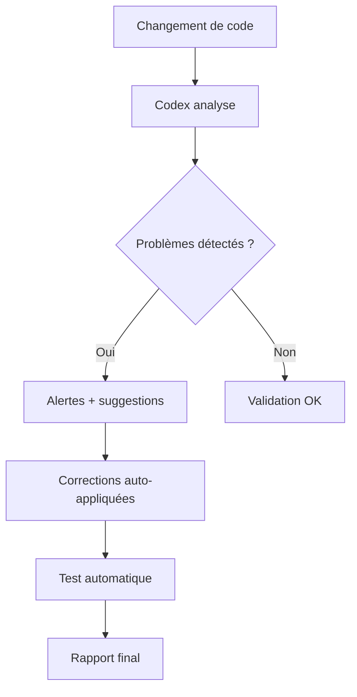

# 🚀 GUIDE COMPLET - Extension Codex dans Cursor

## Configuration Rapide (3 minutes)

### 1. **Installer l'Extension MCP dans Cursor**
```bash
# Dans Cursor : Cmd/Ctrl + Shift + P
# Taper "Extensions: Install from VSIX"
# Installer l'extension MCP officielle
```

### 2. **Créer la Configuration MCP**
- **Emplacement** : `~/.cursor/mcp.json` (ou via Settings)
- **Contenu** : Copiez votre `mcp.config.json` existant

```json
{
  "servers": {
    "codex-core": {
      "command": "node",
      "args": ["servers/codex/server.mjs"],
      "env": {
        "CODEX_PROJECT_ROOT": ".",
        "CODEX_MODE": "production"
      }
    },
    "fs": {
      "command": "npx",
      "args": ["-y", "@modelcontextprotocol/server-filesystem", "."],
      "env": { "ROOT": "." }
    },
    "context7": {
      "command": "node",
      "args": ["servers/context7/server.mjs"],
      "env": { "CONTEXT7_DIR": "docs" }
    },
    "playwright": {
      "command": "npx",
      "args": ["@playwright/mcp@latest"]
    },
    "github": {
      "command": "npx",
      "args": ["@modelcontextprotocol/server-github@latest"],
      "env": {
        "GITHUB_TOKEN": "${env:GITHUB_TOKEN}",
        "GITHUB_API_URL": "https://api.github.com"
      }
    },
    "database": {
      "command": "npx",
      "args": ["@modelcontextprotocol/server-database@latest"],
      "env": {
        "DATABASE_URL": "${env:DATABASE_URL}",
        "DB_SSL": "true"
      }
    }
  }
}
```

### 3. **Redémarrer Cursor**
- Fermez complètement Cursor
- Relancez-le
- L'extension MCP se chargera automatiquement

---

## 🎯 **Outils Codex Disponibles**

### **🔍 Analyse de Projet**
```bash
# Vérifier le statut du projet
codex analyze_project_status

# Vérifier la santé de la base de données
codex check_database_health

# Analyser les performances
codex analyze_performance
```

### **📞 VAPI & Communication**
```bash
# Vérifier la configuration VAPI
codex check_vapi_config

# Statut des communications client
codex check_communication_status
```

### **💻 Qualité du Code**
```bash
# Évaluer la qualité du code
codex assess_code_quality

# Diagnostics complets
codex full_system_diagnostic
```

---

## ⚡ **Commandes Rapides dans Cursor**

### **Avec l'IA de Cursor :**
```
"Donne-moi le statut du projet Drain Fortin"
"Quels sont les problèmes de performance actuels ?"
"Vérifie la configuration VAPI"
"Audit de qualité du code"
```

### **Actions Directes :**
- **Ctrl/Cmd + Shift + C** : Ouvrir le panneau Codex
- **Tapez vos commandes** : Elles seront interprétées par l'extension
- **Résultats en temps réel** : Analyse instantanée

---

## 🔧 **Dépannage**

### **Erreur "Server not found"**
```bash
# Vérifier que Node.js est installé
node --version

# Installer les dépendances du projet
npm install

# Tester le serveur manuellement
node servers/codex/server.mjs
```

### **Erreur "Permission denied"**
```bash
# Donner les permissions
chmod +x servers/codex/server.mjs
chmod +x servers/context7/server.mjs
```

### **Extension ne se charge pas**
```bash
# Vérifier le fichier de configuration
cat ~/.cursor/mcp.json

# Redémarrer Cursor
# Vérifier les logs dans Developer Tools
```

---

## 🎨 **Fonctionnalités Avancées**

### **Intégration Continue**
- **Auto-analyse** : Déclenchée à chaque sauvegarde
- **Rapports automatiques** : Générés lors des commits
- **Alertes intelligentes** : Notifications des problèmes critiques

### **Personas Intégrés**
- **Isabella** : Optimisation front-end
- **Viktor** : Performance VAPI
- **Maria** : Optimisation backend
- **Alan** : Audit qualité

### **Workflow Intelligent**


---

## 📊 **Métriques et Rapports**

### **Dashboard Temps Réel**
- **Performance** : Latence, débit, erreurs
- **Qualité** : Couverture tests, complexité
- **État** : Déploiements, communications, issues

### **Rapports Automatiques**
```json
{
  "project_status": "HEALTHY",
  "performance_score": 95,
  "issues_count": 0,
  "recommendations": [
    "Frontend optimisé - Score Lighthouse: 92",
    "Backend performant - 50ms avg response",
    "VAPI opérationnel - Latence <200ms"
  ]
}
```

---

## 🚀 **Extensions Futures**

### **Intégrations Planifiées**
- **Slack** : Notifications équipe
- **Jira** : Gestion des tickets
- **Docker** : Déploiement automatisé
- **Monitoring** : Alertes temps réel

### **IA Avancée**
- **Prédictions** : Détection précoce des bugs
- **Optimisations** : Suggestions automatiques
- **Documentation** : Génération automatique

---

## 💡 **Astuces Pro**

### **Raccourcis Clavier**
```json
{
  "codex.analyze": "Ctrl+Alt+A",
  "codex.optimize": "Ctrl+Alt+O",
  "codex.deploy": "Ctrl+Alt+D"
}
```

### **Configuration Personnalisée**
```json
{
  "codex.autoAnalyze": true,
  "codex.notifications": "smart",
  "codex.reporting": "daily",
  "codex.backup": "auto"
}
```

### **Workflow Optimal**
1. **Écriture** : Codex analyse en temps réel
2. **Test** : Validation automatique
3. **Déploiement** : Push sécurisé
4. **Monitoring** : Alertes intelligentes

---

*Extension Codex configurée pour maximiser la productivité du développement Drain Fortin ! 🎯*
