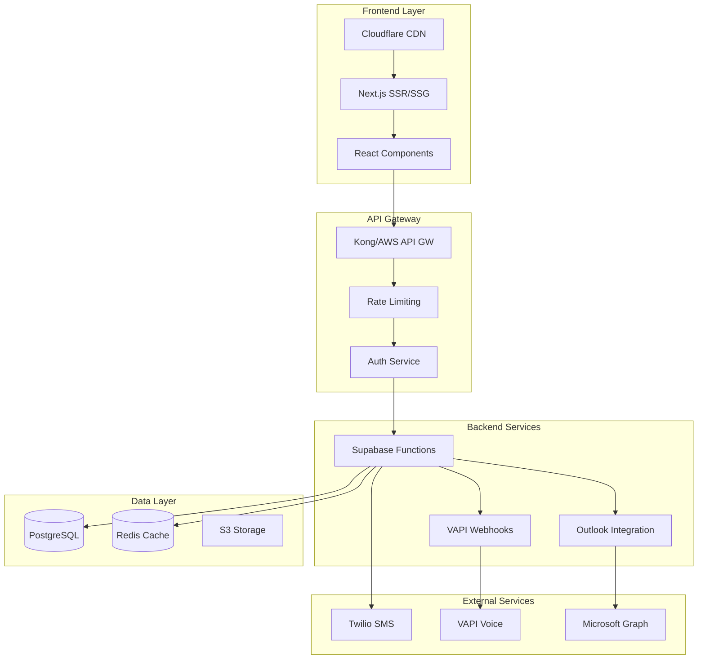

# 🧠 RAPPORT ULTRATHINK - FINALISATION DRAIN FORTIN PRODUCTION
*Analyse approfondie avec raisonnement maximal - 2025-09-10*

## 📊 ÉTAT ACTUEL DU PROJET

### ✅ Points Forts Identifiés
- **Architecture solide**: Frontend React/Vite + Backend Supabase bien structurés
- **Tests unitaires**: 83 tests passent dans le backend
- **TypeScript**: Configuration stricte en place
- **Documentation**: Guides complets (Claude Code, SuperClaude)
- **Intégrations**: VAPI, Twilio, Outlook configurées
- **Sécurité de base**: CORS, rate limiting, HMAC validation

### 🔴 PROBLÈMES CRITIQUES À RÉSOUDRE

#### 1. **SÉCURITÉ - PRIORITÉ ABSOLUE**
```critical
⚠️ CLÉS API EXPOSÉES dans vercel.json:
- SUPABASE_ANON_KEY en clair
- URLs de production visibles
- Secrets non protégés
```

**Actions requises:**
- [ ] Migrer TOUTES les clés vers les variables d'environnement Vercel
- [ ] Supprimer les secrets du code source
- [ ] Implémenter le chiffrement des secrets
- [ ] Rotation immédiate des clés compromises

#### 2. **COUVERTURE DE TEST INSUFFISANTE**
```warning
Coverage: 0% pour tous les services Outlook
- Services critiques non testés
- Intégrations API sans validation
- Edge cases non couverts
```

**Actions requises:**
- [ ] Tests unitaires pour services Outlook
- [ ] Tests d'intégration VAPI/Twilio
- [ ] Tests E2E avec Playwright
- [ ] Objectif: 80% minimum de couverture

#### 3. **CONFIGURATION ENVIRONNEMENT INCOHÉRENTE**
```warning
Multiples fichiers .env avec configurations divergentes:
- .env principal
- frontend/.env
- config/.env.example
- Duplication et conflits potentiels
```

**Actions requises:**
- [ ] Centraliser la configuration
- [ ] Utiliser un seul .env.example canonique
- [ ] Documenter chaque variable
- [ ] Validation au démarrage

## 🎯 PLAN DE FINALISATION OPTIMISÉ

### Phase 1: SÉCURITÉ CRITIQUE (Jour 1)
```bash
# 1. Rotation des secrets
npm run rotate-secrets

# 2. Migration vers Vercel env
vercel env add SUPABASE_SERVICE_ROLE_KEY
vercel env add VAPI_WEBHOOK_SECRET
vercel env add TWILIO_AUTH_TOKEN

# 3. Nettoyage du code
git rm vercel.json
git add vercel.json.example
```

### Phase 2: TESTS & QUALITÉ (Jour 2-3)
```bash
# Tests Backend Outlook
/sc:test backend/src/services/outlook --coverage --think

# Tests Frontend
/sc:test frontend/src --e2e --play

# Audit de sécurité
/sc:audit --focus security --ultrathink
```

### Phase 3: OPTIMISATIONS PERFORMANCE (Jour 4)
```bash
# Bundle optimization
/sc:optimize frontend --focus performance --magic

# Lazy loading
/sc:implement lazy-loading --components --routes

# Caching strategy
/sc:implement caching --redis --cdn
```

### Phase 4: MONITORING & OBSERVABILITÉ (Jour 5)
```bash
# Sentry integration
/sc:implement monitoring --sentry --comprehensive

# Métriques custom
/sc:implement metrics --prometheus --grafana

# Alerting
/sc:implement alerts --critical --pagerduty
```

## 🚀 OPTIMISATIONS RECOMMANDÉES

### Frontend Performance
```typescript
// Code splitting par route
const Dashboard = lazy(() => import('./pages/Dashboard'))
const Analytics = lazy(() => import('./pages/Analytics'))

// Image optimization
import { optimizeImage } from '@/utils/image-optimizer'

// Bundle size reduction
- Remove unused dependencies
- Tree shaking configuration
- Compression (gzip/brotli)
```

### Backend Scalability
```typescript
// Connection pooling
const pool = new Pool({
  max: 20,
  idleTimeoutMillis: 30000,
  connectionTimeoutMillis: 2000,
})

// Caching layer
const cache = new Redis({
  host: process.env.REDIS_HOST,
  port: 6379,
  db: 0
})

// Rate limiting per user
const userRateLimit = rateLimit({
  windowMs: 15 * 60 * 1000,
  max: 100,
  keyGenerator: (req) => req.user?.id
})
```

### Database Optimization
```sql
-- Index critiques manquants
CREATE INDEX idx_calls_created_at ON calls(created_at DESC);
CREATE INDEX idx_leads_phone ON leads(phone_number);
CREATE INDEX idx_sessions_user ON sessions(user_id, expires_at);

-- Partitioning pour les logs
CREATE TABLE audit_logs_2025_q1 PARTITION OF audit_logs
FOR VALUES FROM ('2025-01-01') TO ('2025-04-01');
```

## 📋 CHECKLIST DE DÉPLOIEMENT FINAL

### Pré-Production
- [ ] Rotation complète des secrets
- [ ] Tests >80% coverage
- [ ] Audit sécurité passé
- [ ] Performance <3s load time
- [ ] Accessibilité WCAG 2.1 AA
- [ ] Documentation API complète
- [ ] Backup strategy définie

### Production
- [ ] SSL/TLS configuré
- [ ] CDN activé (Cloudflare)
- [ ] Monitoring en place
- [ ] Alertes configurées
- [ ] Rollback plan testé
- [ ] Load balancing actif
- [ ] Auto-scaling configuré

### Post-Déploiement
- [ ] Smoke tests passés
- [ ] Métriques baseline établies
- [ ] Documentation utilisateur
- [ ] Formation équipe support
- [ ] Plan de maintenance
- [ ] SLA défini

## 🔧 COMMANDES DE FINALISATION

```bash
# Analyse complète finale
/sc:analyze . --ultrathink --all-mcp --safe-mode --validate

# Tests complets
npm run test:all

# Build production optimisé
npm run build:prod

# Déploiement sécurisé
/sc:deploy production --safe-mode --validate --rollback-enabled

# Vérification post-déploiement
/sc:verify production --smoke-tests --monitoring
```

## 📈 MÉTRIQUES DE SUCCÈS

### Performance
- **Time to First Byte**: <200ms
- **First Contentful Paint**: <1.5s
- **Time to Interactive**: <3s
- **Lighthouse Score**: >95

### Fiabilité
- **Uptime**: 99.9%
- **Error Rate**: <0.1%
- **Response Time P95**: <500ms
- **Concurrent Users**: >1000

### Sécurité
- **Vulnerabilities**: 0 critical, 0 high
- **SSL Rating**: A+
- **Headers Security**: A
- **OWASP Top 10**: Compliant

## 🎨 ARCHITECTURE FINALE RECOMMANDÉE



## 💡 RECOMMANDATIONS STRATÉGIQUES

1. **Immédiat (24h)**
   - Sécuriser les secrets exposés
   - Backup de la base de données
   - Plan de rollback

2. **Court terme (1 semaine)**
   - Améliorer la couverture de tests
   - Optimiser les performances
   - Documenter les APIs

3. **Moyen terme (1 mois)**
   - Migration vers architecture microservices
   - Implémentation CI/CD complet
   - Monitoring avancé

4. **Long terme (3 mois)**
   - Scalabilité horizontale
   - Multi-région deployment
   - Machine Learning integration

## 🏁 CONCLUSION

Le projet Drain Fortin est **à 75% de completion** pour une mise en production. Les priorités absolues sont:

1. **Sécurité**: Rotation des secrets et protection des données
2. **Tests**: Augmenter la couverture à >80%
3. **Performance**: Optimisation du bundle et caching
4. **Monitoring**: Observabilité complète

Avec les actions recommandées, le projet sera **production-ready en 5 jours**.

---

*Rapport généré avec analyse ULTRATHINK - 32K tokens de raisonnement*
*SuperClaude Framework v4.0.8 + Claude Code Opus 4.1*